# ETL-Pros
Basketball player stat analysis focused on utilizing the extract-transform-load process.
# College Report
Jeremy Stewart:
----------------
## Sources & Files
* Source of Data: https://www.sports-reference.com/cbb/play-index/psl_finder.cgi
* Files Considered: ncaaplayerstats.csv, ncaa_career_avgs.csv, ncaa_career_totals.csv, ncaa_stats_per_season.csv, etl_pros.ipnyb
## NCAA Player Stats
### Extraction 
* Utilized "Sports-Reference.com" Player Season Finder to query site's database
* Searched for single season data from "any" to "2019-20" seasons
* Query results sorted by Points (scored)
* Used site's share function to extract tables in csv format
* Stacked 30 pages of player data into single csv file containing 3000 rows and 27 columns
### Transformation 
* Renamed columns appropriately
* Observed row counts and series data types
* Removed unneed columns
* Dropped Rows with null values to avoid skewing data
* Used as a clean foundation for following tables to be loaded
## NCAA Player Career Averages
### Extraction 
* Derived from grouping original csv by Player series
* Created new dataframe to hold mean of each statistical category over each player's college career
### Transformation 
* Determined beginning and end of each player's career by finding min and max season years
* Dropped series with irrelevant means
* Merged Min/Max dataframes with Mean dataframe
* Final merge with "Player_Lookup.csv" to display stats for players who have NBA Draft and NBA Stat data
* Saved as a new csv
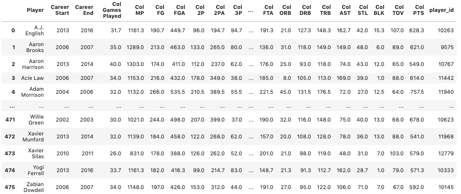
### Load 
* Created a new table in PosgreSQL named "ncaa_career_avgs"
* Loaded transformed csv into new table
## NCAA Player Career Totals
### Extraction 
* Derived from grouping original csv by Player series
* Created new dataframe to hold sums of each statistical category over each player's college career
### Transformation 
* Determined beginning and end of each player's career by finding min and max season years
* Dropped series with irrelevant means
* Merged Min/Max dataframes with Mean dataframe
* Final merge with "Player_Lookup.csv" to display stats for players who have NBA Draft and NBA Stat data
* Saved as a new csv
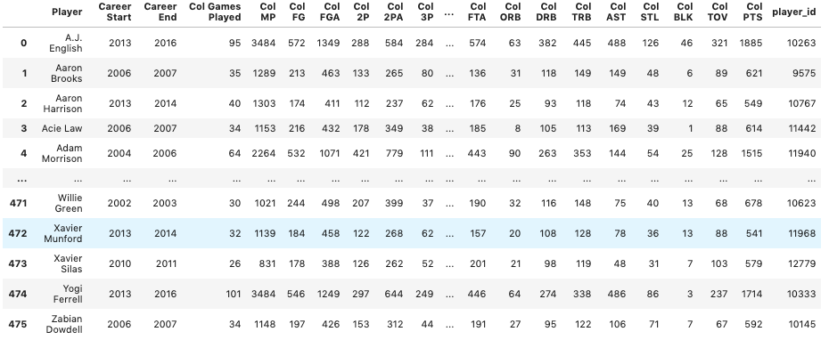
### Load 
* Created a new table in PosgreSQL named "ncaa_career_totals"
* Loaded transformed csv into new table
## NCAA Player Stats Per Season
### Extraction/Transformation 
* Created by merging original cleaned dataframe with dataframe that contained NBA players
* Saved as a new csv
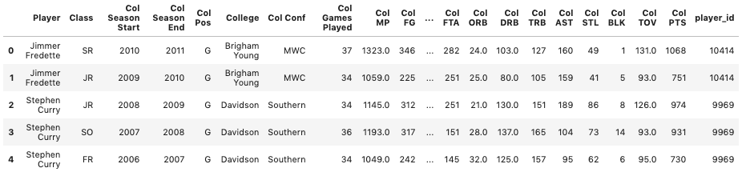
### Load 
* Created a new table in PosgreSQL named "ncaa_stats_per_season"
* Loaded transformed csv into new table
# Draft Report
Luke Ellison:
--------------
Worked on cleaning draft data. Data was pulled from a seperate source than other NBA/College player stats but also came from kaggle [here](www.kaggle.com/pmp5kh/nba-draft-19802017/data) 
APIs we looked at either didn't match up with the scope of the project (too small/recent) or costed money so we decided to stick with using csv's pulled from kaggle for the most part, making things fairly streamlined.

Cleaning and transforming the data in my case was quite a bit trickier. Comments in the cleaning file contain step by step explainations but essentially the trouble was reformatting the names in such a way where the data could be merged with the player_lookup via the given player name. This was particularly difficult due to encoding issues with foriegn names. Some names could be cleaned through excel's find and replace function and comparing to other player data, however at a certain point some rows had to be dropped in the interest of time. I also worked on cleaning the seasonal player data on the nba side. (though Nirmal apparently did it one his own as well) This one was much more straightforward because it after dropping null values and adjusting names, merging to connect IDs dropped all the data outside the scope of the project. 

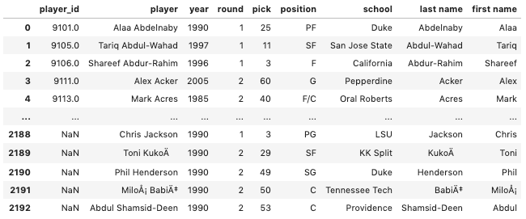

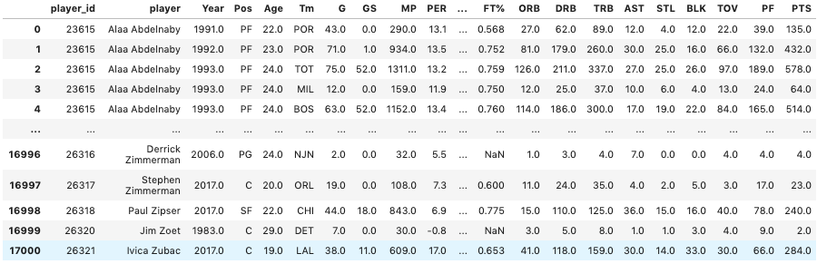

We used postgresql to store our data. This was mostly because formatting a player ID key and sorting by players in a relational database was much more practical than having dictionary data for each player given the large number of stats available. We used quickdatabasediagrams.com to create the general format and addressed datatype issues as we moved along. Mostly involving column name adjustments. SQL files in my (Luke's) branch mostly used for test purposes. Nirmal handled the rest of the sql uploads. Finally added Visualizations to show usability of data.
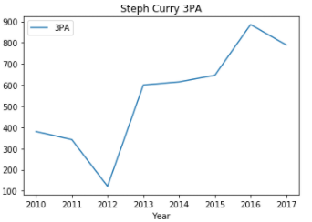  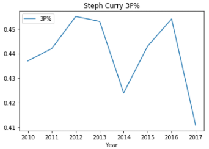
# NBA Report
Nirmal Jacob:
-----------
## Sources & Files
- Source of Data: https://www.kaggle.com/drgilermo/nba-players-stats
- Files Considered: player_data.csv ,  Seasons_Stats.csv
## Lookup table creation 
### Extraction 
- [x] Read the Player data csv file
### Transformation 
- [x] Take only the player name and create a new dataframe
- [x] In the newly created dataframe create two new columns for first name and last name
- [x] Remove any null value fields from the dataframe

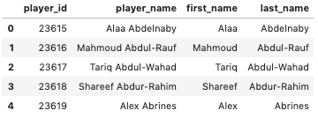
### Load 
- [x] Create a new table in PosgreSQL named players
- [x] Load the dataframe created in the transformation phase into the players table
- [x] Since players has an player_id column it will create an unique id for each of the player name
- [x] Delete any dupes from the player table
### Extraction 
- [x] Extract the records from the database into a CSV so that other stakeholders can use the IDs and remain consistent
## Player Information
### Extraction 
- [x] Read the Player data csv file
- [x] Read the Player csv file
- [x] Read the Player lookup csv file
### Transformation 
- [x] Merge the player data, player and the player lookup as an inner join on player name
- [x] Only select the fields player id, date of birth, city of birth, state of birth
- [x] Rename the columns in a more descriptive manner
- [x] Remove any null value fields from the dataframe

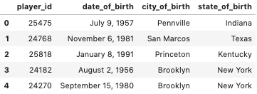
### Load 
- [x] Create a new table in PosgreSQL named player_information
- [x] Load the dataframe created in the transformation phase into the player_information table
### Extraction 
- [x] Extract the records from the database into a CSV
## NBA Player Information
### Extraction 
- [x] Read the Player data csv file
- [x] Read the Player lookup csv file
### Transformation 
- [x] Merge the player data and the player lookup as in inner join on player name
- [x] Only select the fields player id, career start year, career end year, height, & weight
- [x] Remove any null value fields from the dataframe
- [x] Rename the columns in a more descriptive manner

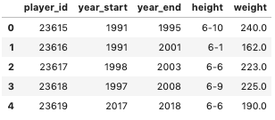
### Load 
- [x] Create a new table in PosgreSQL named player_nba_information
- [x] Load the dataframe created in the transformation phase into the player_nba_information table
### Extraction 
- [x] Extract the records from the database into a CSV
## NBA Stats Information
### Extraction 
- [x] Read the Player stats data csv file
- [x] Read the Player lookup csv file
### Transformation 
- [x] Merge the player stats data and the player lookup as in inner join on player name
- [x] Only select the fields player id, age of the player, year of the stat, team played for, position played
    - [x] Feilds continued .. minutes played that season, points scored that season, two points scored that season
    - [x] Feilds continued .. free throws made that season, assists that season, steals that season 
    - [x] Feilds continued .. blocks that season, turnovers that season, & field goal percentage that season
- [x] Rename the columns in a more descriptive manner
- [x] Remove any null value fields from the dataframe

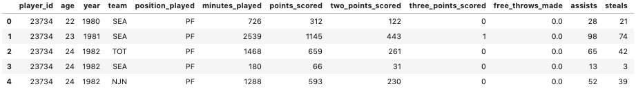
### Load 
- [x] Create a new table in PosgreSQL named player_nba_stats
- [x] Load the dataframe created in the transformation phase into the player_nba_stats table
### Extraction 
- [x] Extract the records from the database into a CSV
